#  GOLDEN-AGE-OF-VIDEO-GAMES
 
## SQL Data Exploration using SQL(Postgresql)

# Background to the Report
- Video games are big business: the global gaming market is projected to be worth more than $300 billion by 2027 according to Mordor Intelligence. 
With so much money at stake, the major game publishers are hugely incentivized to create the next big hit. 
But are games getting better, or has the golden age of video games already passed?

- In this project, we'll explore the top 400 best-selling video games created between 1977 and 2020. We'll compare a dataset on game sales with critic and user reviews to determine whether or not video games have improved as the gaming market has grown.
Our database contains two tables. We've limited each table to 400 rows for this project, 
but you can find the complete dataset with over 13,000 games on Kaggle.
 ---
### DATA TYPES OF THE GAME SALES DATA
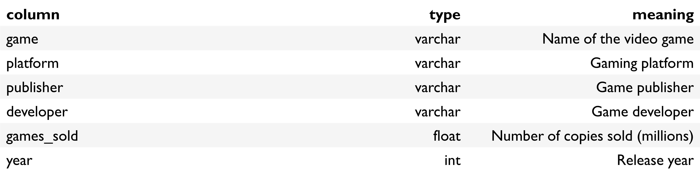
---
## Data Types of the Review Table
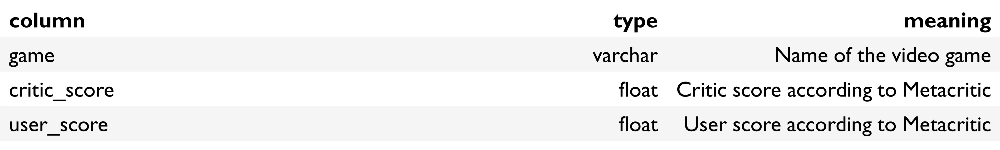
---
### SQL Queries - top ten best-selling games 

- Select all information for the top ten best-selling games 
- Order the results from best-selling game down to tenth best-selling
---
SELECT * \
**FROM game_sales** \
**ORDER BY games_sold DESC** \
**LIMIT 10;**
 ---
 ### SQL Queries - top ten best-selling games result 
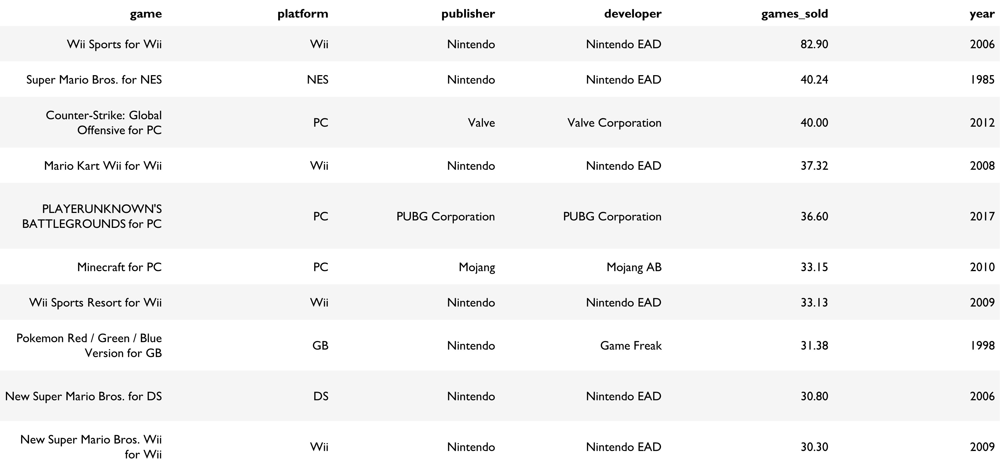
---
### SQL Queries – MISSING REVIEW SCORES 

- Wow, the best-selling video games were released between 1985 to 2017! 
- That's quite a range; we'll have to use data from the reviews table to gain more insight on the best years for video games.
- First, it's important to explore the limitations of our database. 
One big shortcoming is that there is not any reviews data for some of the games on the game_sales table.
---
### SQL Queries –  MISSING REVIEW SCORES 
Join games_sales and reviews\
Select a count of the number of games where both critic_score and user_score are null
---
**SELECT COUNT(game_sales.game)**\
**FROM game_sales**\
**LEFT JOIN reviews**\
**ON reviews.game=game_sales.game**\
**WHERE critic_score is NULL AND user_score IS NULL**; 

Count: 31
---
 ### SQL Queries – YEARS THAT VIDEO GAME CRITICS LOVED 
 3. Years that video game critics loved/
- It looks like a little less than ten percent of the games on the game_sales table don't have any reviews data. /

- That's a small enough percentage that we can continue our exploration, but the missing reviews data is/
a good thing to keep in mind as we move on to evaluating results from more sophisticated queries./

- There are lots of ways to measure the best years for video games! Let's start with what the critics think/
 ### SQL Queries – YEARS THAT VIDEO GAME CRITICS LOVED! 
Join the game_sales and reviews tables
Group by release year

Order the data from highest to lowest avg_critic_score and limit to 10 results
---
**SELECT year, ROUND(AVG(critic_score),2) AS avg_critic_score**\
**FROM game_sales**\
**INNER JOIN reviews**\
**ON reviews.game=game_sales.game**\
**GROUP BY year**\
**ORDER BY avg_critic_score DESC**\
**LIMIT 10**;
 ---
## SQL Queries – YEARS THAT VIDEO GAME CRITICS LOVED! 
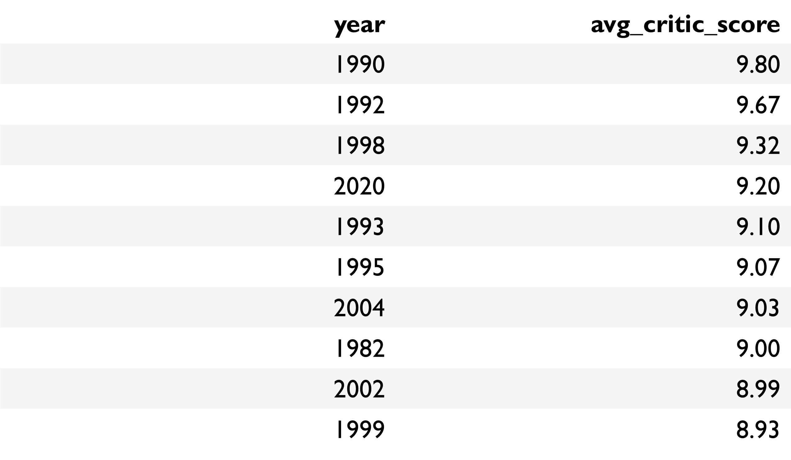

 ---
## 4. WAS 1982 REALLY THAT GREAT?/
- The range of great years according to critic reviews goes from 1982 until 2020: we are no closer to finding the golden age of video games!\

- Hang on, though. Some of those avg_critic_score values look like suspiciously round numbers for averages. 
The value for 1982 looks especially fishy. 
Maybe there weren't a lot of video games in our dataset that were released in certain years.

- Let's update our query and find out whether 1982 really was such a great year for video games.
## SQL Queries - WAS 1982 REALLY THAT GREAT? 
 
---
**SELECT year, ROUND(AVG(critic_score),2) AS avg_critic_score**,\
**COUNT(game_sales.game) AS num_games**\
**FROM game_sales**\
**INNER JOIN reviews**\
**ON reviews.game=game_sales.game**\
**GROUP BY year**\
**HAVING COUNT(game_sales.game)>4**\
**ORDER BY avg_critic_score DESC**\
**LIMIT 10**; 

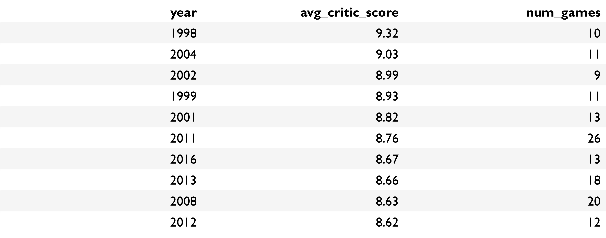
---
## SQL Queries –  YEARS THAT DROPPED OFF THE LIST OF CRITICS’ FAVOURITE 
### 5. Years that dropped off the critics' favorites list
- That looks better! The num_games column convinces us that our new list of the critics'
top games reflects years that had quite a few well-reviewed games rather than just one or two hits. 

- But which years dropped off the list due to having four or fewer reviewed games? 
Let's identify them so that someday we can track down more game reviews for those years
and determine whether they might rightfully be considered as excellent years for video game releases.

### Set theory skills application here. To get started,/
I created tables with the results of our previous two queries:
- top_critic_years
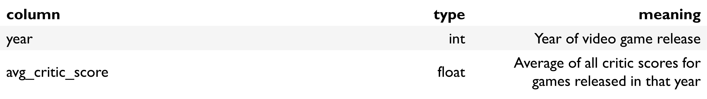
---
- top_critic_years_more_than_4_games

 
 Select the year and avg_critic_score for those years that dropped off the list of critic favorites 
Order the results from highest to lowest avg_critic_score
---
**SELECT year, avg_critic_score**\
**FROM top_critic_years**\
**WHERE year NOT IN (**\
**SELECT year FROM top_critic_years**\
**INTERSECT**\
**SELECT year FROM top_critic_years_more_than_four_games**\
**GROUP BY year**\
**HAVING num_games > 4)**\
**ORDER BY avg_critic_score DESC**;
---
- Years that dropped off the critic favourite list
 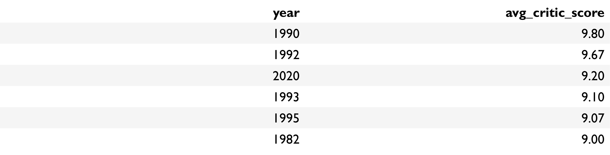
 ### 6. Years video game players loved
- Based on our work in the task above, it looks like the early 1990s might merit \
consideration as the golden age of video games based on critic_score alone, but\
we'd need to gather more games and reviews data to do further analysis.\

- Let's move on to looking at the opinions of another important group of people: players!
To begin, let's create a query very similar to the one we used in Task Four,\
except this one will look at user_score averages by year rather than critic_score averages.
 ### Select year, an average of user_score, and a count of games released in a given year, aliased and rounded
Include only years with more than four reviewed games; group data by year
Order data by avg_user_score, and limit to ten results
---
**SELECT year, ROUND(AVG(user_score),2) AS avg_user_score,** \
**COUNT(game_sales.game) AS num_games**\
**FROM game_sales**\
**INNER JOIN reviews**\
**ON reviews.game=game_sales.game**\
**GROUP BY year**\
**HAVING COUNT(game_sales.game) > 4**\
**ORDER BY avg_user_score DESC**\
**LIMIT 10;**
---
- Years Players Loved Results
 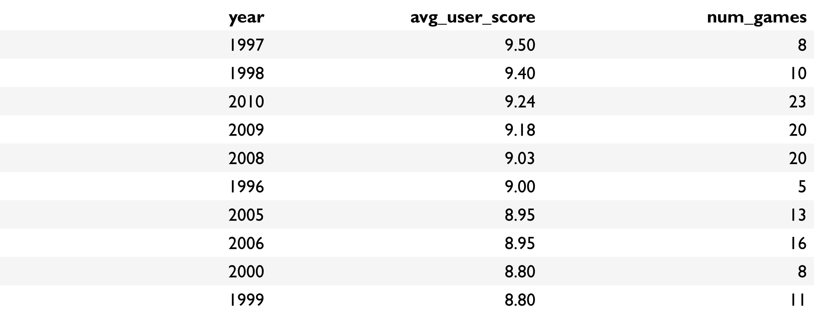
--
### SQL Queries – YEARS that both players and critic 
### 7. Years that both players and critics loved
- Alright, we've got a list of the top ten years according to both critic reviews and user reviews.\ 
Are there any years that showed up on both tables? If so, those years would certainly be excellent ones!

- Recall that we have access to the top_critic_years_more_than_four_games table, which \
stores the results of our top critic years query from Task 4:
Critic_Player_Loved
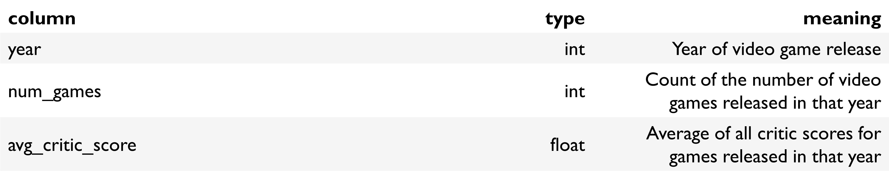
---
 ### Select the year results that appear on both tables

**SELECT year** \
**FROM top_critic_years_more_than_four_games**\
**INTERSECT**\
**SELECT year** \
**FROM top_user_years_more_than_four_games;**\
---
 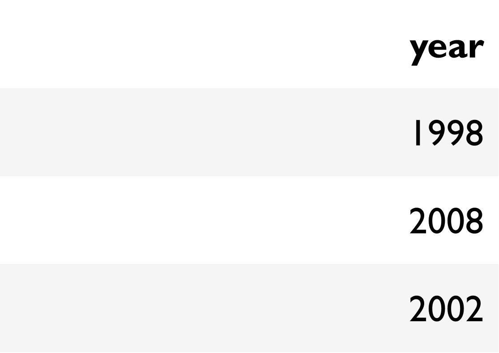
### SQL Queries –  Sales in the best video game years 
  ###  8. Sales in the best video game years
- Looks like we've got three years that both users and critics agreed were in the top ten! There are many
other ways of measuring what the best years for video games are, but let's stick with these years for now.
We know that critics and players liked these years, but what about video game makers? Were sales good? Let's find out.

  Select year and sum of games_sold, aliased as total_games_sold; order results by total_games_sold descending. 
  Filter game_sales based on whether each year is in the list returned in the previous task:\
  ---
**SELECT year, SUM(games_sold) AS total_games_sold**\
**FROM game_sales**\
**WHERE year IN (**\
**SELECT year** \
**FROM top_critic_years_more_than_four_games**\
**INTERSECT**\
**SELECT year** \
**FROM top_user_years_more_than_four_games)**\
**GROUP BY year**\
**ORDER BY total_games_sold DESC** 

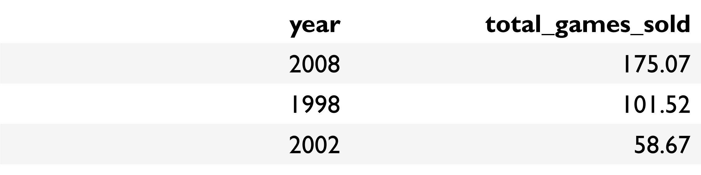 
 
